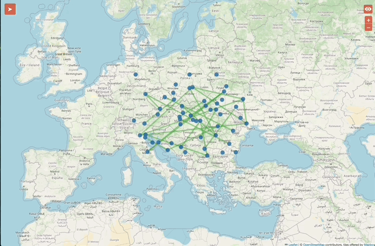
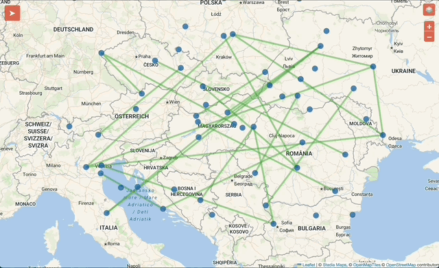

# netjsongraph.js

[](https://github.com/openwisp/netjsongraph.js/actions/workflows/ci.yml)
[](https://coveralls.io/github/openwisp/netjsongraph.js?branch=master)


Leverage the power of [EchartsJS](https://github.com/apache/incubator-echarts) and [LeafletJS](https://github.com/Leaflet/Leaflet) to visualize network topology using the
[NetJSON](http://netjson.org) `NetworkGraph` format.

Build powerful and interoperable visualizations without losing flexibility!

## Live Examples

Find below a rich set of live examples for the main use cases supported by NetJSONGraph.js.

### Network graph

[](https://openwisp.github.io/netjsongraph.js/examples/netjsongraph.html)

Visualize a NetJSON NetworkGraph with pan/zoom, labels and tooltips.

### Geographic map

[](https://openwisp.github.io/netjsongraph.js/examples/netjsonmap.html)

Plot nodes by geographic coordinates on a Leaflet basemap; pan/zoom with markers.

### Indoor map

[](https://openwisp.github.io/netjsongraph.js/examples/netjsonmap-indoormap.html)

Use a 2D floorplan (Leaflet CRS.Simple) to place and connect indoor nodes.
This example demonstrates the visualization of a mesh network topology graph on a 2D floorplan image.

### Network Graph with custom attributes and legend

[](https://openwisp.github.io/netjsongraph.js/examples/netjsongraph-elementsLegend.html)

Style nodes/links by categories and present them in a legend.

### WiFi Clients Graph

[](https://openwisp.github.io/netjsongraph.js/examples/netjsongraph-wifi-clients.html)

Visualize per-node client counts as small colored dots around each node.

### Clustering

[](https://openwisp.github.io/netjsongraph.js/examples/netjson-clustering.html)

Aggregate nearby nodes into clusters with automatic overlap prevention of clusters having different colors.

### Switch graph mode (Network Graph / Geographic Map)

[](https://openwisp.github.io/netjsongraph.js/examples/netjson-switchGraphMode.html)

Switch between force-directed graph and geographic map views.

### Switch render mode (Canvas/SVG)

[](https://openwisp.github.io/netjsongraph.js/examples/netjson-switchRenderMode.html)

Toggle the renderer to balance quality/performance.

### Nodes expand or fold

[](https://openwisp.github.io/netjsongraph.js/examples/netjsongraph-nodeExpand.html)

Expand neighbors on click to focus on subgraphs; fold to declutter.

### Geographic map with GeoJSON data

[](https://openwisp.github.io/netjsongraph.js/examples/njg-geojson.html)

Load GeoJSON FeatureCollections; they are converted to NetJSON nodes/links automatically.

### Multiple tiles render

[](https://openwisp.github.io/netjsongraph.js/examples/netjsonmap-multipleTiles.html)

Switch between different tile providers and styles.

### Leaflet plugins

[](https://openwisp.github.io/netjsongraph.js/examples/netjsonmap-plugins.html)

Use draw/measure and other Leaflet plugins in map mode.

### Search elements

[](https://openwisp.github.io/netjsongraph.js/examples/netjson-searchElements.html)

Fetch filtered data and update the view in-place.

### JSONDataUpdate using override option

[](https://openwisp.github.io/netjsongraph.js/examples/netjsonmap-nodeTiles.html)

Update features/styles by zoom using JSONDataUpdate.

### JSONDataUpdate using append option

[](https://openwisp.github.io/netjsongraph.js/examples/netjsonmap-appendData.html)

Append new nodes/links on the fly without a full reload.

### Append data using arrays

[](https://openwisp.github.io/netjsongraph.js/examples/netjsonmap-appendData2.html)

Append data from an array of sources at startup.

### Multiple links render

[](https://openwisp.github.io/netjsongraph.js/examples/netjsongraph-multipleLinks.html)

Display up to two distinct physical/logical links between the same endpoints.

### Multiple interfaces

[](https://openwisp.github.io/netjsongraph.js/examples/netjson-multipleInterfaces.html)

Deduplicate, merge interfaces and enrich link info before rendering.

### Date parse

[](https://openwisp.github.io/netjsongraph.js/examples/netjson-dateParse.html)

Normalize ISO timestamps to the browser timezone in node/link details.

### Install and run examples

```
yarn install
yarn start
```

### Run Tests

The test suite includes browser tests, so **ensure that ChromeDriver is installed** before running them.

Start the development server first:

```
# Required for Selenium browser tests
yarn start
```

Then, in a separate terminal, run:

```
yarn test
```

To run a specific test suite:

```
yarn test test/netjsongraph.browser.test.js
```

### Arguments

netjsongraph.js accepts two arguments.

1. **url (required, string|array|object)**: URL(s) to fetch the JSON data from. It supports both [NetJSON](http://netjson.org) and GeoJSON data formats. You can also pass a NetJSON or GeoJSON object directly.

NetJSON format used internally is based on [networkgraph](http://netjson.org/rfc.html#rfc.section.4) but with a slight difference as follows：

```JS
{
    nodes: [{
        properties ? : {
            // Define node category
            category ? : String,

            /*
                Define the geographic coordinates of the node.
                Required when rendering a map.
            */
            location ? : {
                lng: Float,
                lat: Float,
            },

            // Define node updated time
            time ? : String
        }
    }],
    links: [{
        properties ? : {
            // Define link updated time
            time ? : String
        }
    }]
    flatNodes ? : {
        <node id>: node Object
    }
}
```

2. **options (optional, object)**: custom options described below

- `el`

  **Default**: `body`

  The element in which the graph or map is rendered. You can pass any valid HTML element, or a CSS selector string (e.g., `'#myGraph'`, `'.graph-container'`).

  **Note on Styling**:
  The library's core CSS styles are scoped under the `.njg-container` class to prevent conflicts with your project's styles. This class is automatically added to the `el` element.
  - If `el` is `document.body` (the default), the library automatically styles both the `<html>` and `<body>` elements for full-page rendering (e.g., `width: 100%`, `height: 100%`, `margin: 0`).
  - If you provide a custom element for `el`, you are responsible for ensuring that this element and its parent elements have appropriate dimensions (width, height) for the graph to be visible.

- `render`

  **Default**: `graph`

  The rendering mode. You can render the map by setting it as `map`.

- `crs`

  **Default**: `L.CRS.EPSG3857,`

  Leaflet uses `L.CRS.EPSG3857` as the default CRS. If no CRS is specified, this default is automatically applied. To support custom projections such as 2D planes you can override this by passing a custom CRS like `L.CRS.Simple`.

- `metadata`

  **Default**: `true`

  Whether to show [NetJSON](https://netjson.org) NetworkGraph metadata or not. You can also set it `false` to disable it.

- `svgRender`

  **Default**: `false`

  Whether to render it as SVG or not. You can also set it `true` to enable it. Canvas is used when it is set to `false`.

- `switchMode`

  **Default**: `false`

  Whether to allow switching between graph and map render or not. You can also set it `true` to enable it.

- `showLabelsAtZoomLevel`

  **Default**: `7`

  The zoom level at which the labels are shown. This only works when `render` is set to `map`.
  In graph mode, the overlapping labels are hidden automatically when zooming.

- `showGraphLabelsAtZoom`

  Provide an explicit label-visibility threshold for graph mode (ECharts `graph`).
  This is a continuous scale factor, not a Leaflet zoom level. When set to a number (> 0), node
  labels are shown only when the current series zoom is greater than or equal to the value.
  Default: disabled. To enable it, set a positive number like `2`.

  Example:

  ```js
  new NetJSONGraph(url, {
    render: "graph",
    showGraphLabelsAtZoom: 2, // hide labels until user zooms in sufficiently
  });
  ```

- `maxPointsFetched`

  **Default**: `10000`

  The maximum number of nodes to fetch from the server.

- `loadMoreAtZoomLevel`

  **Default**: `9`

  The zoom level at which more nodes are loaded from the server when the total number of nodes are greater than `maxPointsFetched`. These nodes are loaded based on the geographic extent of the map.

- `clustering`

  **Default**: `false`

  Whether to enable clustering of nodes or not. You can also set it `true` to enable it.

- `clusteringThreshold`

  **Default**: `100`

  The threshold of clustering. When the number of nodes is greater than this value, the clustering will be enabled.

- `disableClusteringAtLevel`

  **Default**: `8`

  The zoom level at which clustering is disabled. When the zoom level is greater than this value, all the clusters will be expanded.

- `clusterRadius`

  **Default**: `80`

  The maximum radius that a cluster will cover. Decreasing will make more, smaller clusters and vice versa.

- `clusteringAttribute`

  The property used to cluster the nodes. The nodes with the same properties will be clustered together.

- `dealDataByWorker`

  The url to the worker file if you want to deal the data by a worker.

- `echartsOption`

  The global configuration for Echarts. You can pass any valid Echarts [options](https://echarts.apache.org/en/option.html#title).

- `graphConfig`

  The configuration for the graph render.
  It consists of the following properties:

  ```JS
    graphConfig:{
        series:{
            nodeStyle:{
                // The style of the nodes
            },
            linkStyle:{
                // The style of the links
            },
            nodeSize: string|number,
        },
        baseOptions:{
            // The global configuration for Echarts specifically for the graph.
        }
    }

  ```

  You can see the list available options which can be used in the `series` property of the `graphConfig` in the [Echarts documentation](https://echarts.apache.org/en/option.html#series-graph).

  The `nodeStyle` and `linkStyle` properties are used to customize the style of the nodes and links. The list of all available style properties can be found in the [Echarts documentation](https://echarts.apache.org/en/option.html#series-graph.itemStyle).

  The `nodeSize` property is used to customize the size of the nodes.

  The `baseOptions` property is used to customize the global configuration for Echarts specifically for the graph. This is useful when you have set `switchMode` to `true` and you have to set separate configuration for the graph and the map.

- `mapOptions`

  The configuration for the map render.
  It consists of the following properties:

  ```JS
    mapOptions:{
        nodeConfig:{
            nodeStyle:{
                // The style of the nodes
            },
            nodeSize: string|number,
        },
        linkConfig:{
            linkStyle:{
                // The style of the links
            },
        },
        clusterConfig:{
          // The configuration for the clusters
        },
        baseOptions:{
            // The global configuration for Echarts specifically for the map.
        }
    }
  ```

  We use [Leaflet](https://leafletjs.com) to render the map. You can also pass any valid [Leaflet options](https://leafletjs.com/reference.html#map-option) in `mapOptions`.

  It is mandatory to set `center` in `mapOptions` when you are using the map render which is used to set the initial geographic center of the map. You can learn more about it in the [Leaflet documentation](https://leafletjs.com/reference.html#map-center).

  `nodeConfig` deals with the configuration of the nodes. You can pass any valid [Echarts options](https://echarts.apache.org/en/option.html#series-scatter) in `nodeConfig`.

  The `nodeStyle` property is used to customize the style of the nodes. The list of all available style properties can be found in the [Echarts documentation](https://echarts.apache.org/en/option.html#series-scatter.itemStyle).

  The `nodeSize` property is used to customize the size of the nodes.

  The `clusterConfig` property is used to customize the clusters. You can pass any valid [Echarts options](https://echarts.apache.org/en/option.html#series-scatter.data) in `clusterConfig`. If you are using GeoJSON data, you can customize the cluster styles by using the CSS class`marker-cluster`. You can also use property values when clustering based on data properties as class names.

  `linkConfig` deals with the configuration of the links. You can pass any valid [Echarts options](https://echarts.apache.org/en/option.html#series-lines) in `linkConfig`.

  The `linkStyle` property is used to customize the style of the links. The list of all available style properties can be found in the [Echarts documentation](https://echarts.apache.org/en/option.html#series-lines.lineStyle).

- `mapTileConfig`

  The configuration for the map tiles. You can use multiple tiles by passing an array of tile configurations.

  ```JS
    mapTileConfig:[
        ...,
        {
            label: string,
            urlTemplate: string,
            options:{
                minZoom: number,
                maxZoom: number,
                attribution: string,
            }
        },
        ...
    ]

  ```

  `urlTemplate` is the URL template of the tile provider. You can learn more about the options in the [Leaflet documentation](https://leafletjs.com/reference.html#tilelayer-minzoom).

- `nodeCategories`

  The configuration for different categories of nodes if your data contain nodes of various categories. You can pass an array of categories.
  Each category is an object with the following properties:

  ```JS
      nodeCategories:[
          ...,
          {
              name: string,
              nodeStyle: {
                  // The style of the nodes
              },
              nodeSize: string|number,
          },
          ...
      ]
  ```

  `name` is the name of the category. You can also pass any valid [Echarts options](https://echarts.apache.org/en/option.html#series-graph.itemStyle) in `nodeStyle`.

- `linkCategories`

  The configuration for different categories of links if your data contain links of various categories. You can pass an array of categories.
  Each category is an object with the following properties:

  ```JS
      linkCategories:[
          ...,
          {
              name: string,
              linkStyle: {
                  // The style of the links
              },
          },
          ...
      ]
  ```

  `name` is the name of the category. You can also pass any valid [Echarts options](https://echarts.apache.org/en/option.html#series-graph.lineStyle) in
  `linkStyle`.

- `geoOptions`

  The configuration for the GeoJSON render. It consists of the following properties:

  ```JS
      geoOptions:{
         style:{
             // The style GeoJSON features
         },
      }
  ```

  You can customize the style of GeoJSON features using `style` property. The list of all available properties can be found in the [Leaflet documentation](https://leafletjs.com/reference.html#geojson).

- `bookmarkableActions`

  Configuration for adding url fragments when a node is clicked.

  ```javascript
      bookmarkableActions: {
        enabled: boolean,
        id: string,
        zoomOnRestore: boolean,
        zoomLevel: number,
      }
  ```

  **Note: This feature is disabled by default.**

  You can enable or disable adding url fragments by setting enabled to true or false. When enabled, the following parameters are added to the URL:
  1. id – A prefix used to uniquely identify the map.
  2. nodeId – The id of the selected node.

  This feature allows you to create shareable and restorable map or graph states using URL fragments. When this feature is enabled, the URL updates automatically whenever you click a node or a link in your NetJSONGraph visualization. This makes it easy to share a specific view, restore it later, or navigate between different states using the browser’s back and forward buttons.

  This feature works across all ECharts graphs, as well as Leaflet-based maps including geographic and indoor floorplan maps and it supports multiple maps or graphs on the same page. The id parameter is used to uniquely identify which visualization the URL fragment belongs to (for example: `#map1-node=device-1;#map2-node=device-2` ).

  For nodes, the behavior depends on the type of visualization in Leaflet maps, clicking a node updates the URL and on applying the state from url it automatically centers the map on that node, in addition to triggering its click event. In ECharts graphs, only triggers the click event for the node.

  For links, the URL fragment uses the format `source~target` as the `nodeId`. Opening such a URL restores the initial map or graph view and triggers the corresponding link click event.

  If you need to manually remove the URL fragment, you can call the built-in utility method: `netjsongraphInstance.utils.removeUrlFragment('id');` where id is `bookmarkableActions.id`.

- `onInit`

  The callback function executed on initialization of `NetJSONGraph` instance.

- `onRender`

  The callback function executed at the start of initial render.

- `onUpdate`

  The callback function executed at the start of update.

- `afterUpdate`

  The callback function executed after update.

- `onReady`

  The Callback function executed after initial render.

- `prepareData`

  The callback function executed after data has been loaded. Used to convert data to NetJSON Data normally. You can also use this function to categorize the data based on certain properties in your dataset.

- `onClickElement`

  The callback function executed when a node or link is clicked.

### API reference

Looking for configuration details? See the inline docs and type hints in the source code:

- `src/js/netjsongraph.config.js` – default options and configuration structure
- `src/js/netjsongraph.render.js` – rendering internals and option handling
- `src/js/netjsongraph.util.js` – utilities you can override via `setUtils`

## Circle Markers in Graph Mode

It's possible to render small colored circles around each node to represent the amount of connected WiFi clients. The overlay counts WiFi clients as a single total. This helper draws on the same ZRender layer as the graph, so the markers follow pan/zoom/force layout without extra work and do not call `setOption` during the main render.

For a live demo, see the [WiFi Clients Graph example](https://openwisp.github.io/netjsongraph.js/examples/netjsongraph-wifi-clients.html).

#### Data Format

The number of dots rendered around a node is determined by the `clients` field in your NetJSON `nodes` data:

- `clients` (Number or Array)
  - If it's an Array, its length is used as the client count (and the sidebar lists Client [i] entries, e.g., MAC addresses).
  - If it's a Number, the value is used directly as the count.

## GeoJSON handling

netjsongraph.js will now **always** convert GeoJSON input into an internal
NetJSON‐like structure (`nodes` / `links`). The original GeoJSON object is kept
in memory only to render non‐point geometries (Polygons & Multipolygons) as
filled shapes on the Leaflet basemap.

To keep the codebase clean we extracted all GeoJSON‐specific helpers into
`src/js/netjsongraph.geojson.js`:

- `geojsonToNetjson(geojson)` – converts any GeoJSON _FeatureCollection_ into
  NetJSON nodes & links (supports Points, LineStrings, Polygons, Multi\* and
  GeometryCollections).
- `addPolygonOverlays(self)` – draws Polygon / MultiPolygon features on a
  dedicated Leaflet pane so they sit beneath the ECharts overlay but above the
  tile layer.

If you used `map.utils.geojsonToNetjson` the public API is unchanged – it now
forwards to the new helper.

```js
import {geojsonToNetjson} from "netjsongraph/src/js/netjsongraph.geojson";

const netjson = geojsonToNetjson(myGeoJSON);
```

No action is required for most users; these changes simply make the internal
flow clearer and easier to maintain.

## Automatic Cluster Overlap Prevention

When multiple clusters of different categories share identical coordinates, NetJSONGraph now **automatically** offsets them in a circular pattern (pixel-space repulsion). No extra utilities or configuration flags are required—simply enable clustering with a `clusteringAttribute`, and the library handles overlap for you.

See the [Clustering demo](https://openwisp.github.io/netjsongraph.js/examples/netjson-clustering.html).

## Realtime Update

We use [socket.io](https://socket.io/) to monitor data changes which supports WebSockets and Polling. You can call `JSONDataUpdate` when the data change event occurs and pass the data to update the view.

```JS
/**
 * @function
 * @name JSONDataUpdate
 * Callback function executed when data update. Update Information and view.
 *
 * @param  {object|string}  Data     JSON data or url.
 * @param  {boolean}        override If old data need to be overrided? True defaultly. (Attention: Only 'map' render can set it `false`!)
 * @param  {boolean}        isRaw    If the data need to deal with the configuration? True defaultly.
 *
 * @this   {object}         NetJSONGraph object
 *
 */

const graph = new NetJSONGraph("./data/netjsonmap.json", {
    render: "graph",
});

graph.render();

const socket = io("http://localhost:3000/",{ transports : ['websocket'] });

socket.on("connect", function() {
    console.log("client connected");
});
socket.on("disconnect", function() {
    console.log("client disconnected");
});
// Self-monitoring server， re-render when the data changes.
socket.on("netjsonChange", graph.utils.JSONDataUpdate.bind(graph));
```

You can see this in action by executing the following commands:

```
cd examples/realtime_update

yarn install

yarn dev
```

In this demo the nodes and links change after 5 seconds.

#### Search elements

If you want to add search elements function, you just need to pass the url as param to `searchElements`, which will return a function `searchFunc`.
Then you just need to obtain the value input, and pass it to the `searchFunc`.
`searchFunc` is similar to JSONDataUpdate, you can also set `appendData` and `isRaw` params according to different conditions.

```JS
/**
 * @function
 * @name searchElements
 * Add search function for new data.
 *
 * @param  {string}         url      listen url
 *
 * @this   {object}         NetJSONGraph object
 *
 * @return {function}       searchFunc
 */

const graph = new NetJSONGraph("./data/netjsonmap.json", {
    onLoad: function(){
        let searchContainer = document.createElement("div"),
            searchInput = document.createElement("input"),
            searchBtn = document.createElement("button"),
            /*
                Pass in the url to listen to, and save the returned function.
                Please ensure that the return value of the api is the specified json format.
            */
            searchFunc = this.utils.searchElements.call(this, "https://ee3bdf59-d14c-4280-b514-52bd3dfc2c17.mock.pstmn.io/?search=");

        searchInput.setAttribute("class", "njg-searchInput");
        searchInput.placeholder = "Input value for searching special elements.";
        searchBtn.setAttribute("class", "njg-searchBtn");
        searchBtn.innerHTML = "search";
        searchContainer.setAttribute("class", "njg-searchContainer");
        searchContainer.appendChild(searchInput);
        searchContainer.appendChild(searchBtn);
        this.el.appendChild(searchContainer);

        searchInput.onchange = () => {
            // do something to deal user input value.
        };

        searchBtn.onclick = () => {
            let inputValue = searchInput.value.trim();

            /*
                Pass in the relevant search value,
                which will re-render automatically according to the request result within the function.
            */
            if(inputValue === "appendData"){
                // appendData
                searchFunc(inputValue, false);
            }
            else{
                searchFunc(inputValue);
            }

            searchInput.value = "";
        }

        this.utils.hideLoading();
    }
});

graph.render();
```

Demo is [here](https://openwisp.github.io/netjsongraph.js/examples/netjson-searchElements.html).
You can input `test`(overrideData) or `appendData`(appendData) and click the `search` button.
The view will change if the value is `valid`, and you can also click the back button of browser to `go back`.

#### Deal data by WebWorker

You can deal with the data asynchronously by `dealDataByWorker`.

```JS
/**
 * @function
 * @name dealDataByWorker
 * Deal JSONData by WebWorker.
 *
 * @param  {object}    JSONData     NetJSONData
 * @param  {string}    workerFile   url
 * @param  {function}  callback     override data and render defaultly.
 *
 * @this   {object}    _this        NetJSONGraph object
 *
 */
```

Demo is [here](https://openwisp.github.io/netjsongraph.js/examples/netjson-multipleInterfaces.html).
You can simply set the `dealDataByWorker` param in config to process the data asynchronously before rendering.
Of course you can also call the function directly.

#### DateParse

We provide a function -- `dataParse` for parsing the `time` field.
We mainly use it to parse the time into the browser's current time zone based on the incoming matching rules.

```JS
/**
 * @function
 * @name dateParse
 *
 * Parse the time in the browser's current time zone based on the incoming matching rules.
 * The exec result must be [date, year, month, day, hour, minute, second, millisecond?]
 *
 * @param  {string}          dateString    "2000-12-31T23:59:59.999Z"
 * @param  {object(RegExp)}  parseRegular  /^([1-9]\d{3})-(\d{1,2})-(\d{1,2})T(\d{1,2}):(\d{1,2}):(\d{1,2})(?:\.(\d{1,3}))?Z$/ defaultly
 * @param  {number}          hourDiffer    you can custom time difference, default is the standard time difference

*
* @return {string}    Date string
*/
```

If you provide `time` field in node or link's properties, it'll display the parse date in the detail info defaultly.

Demo is [here](https://openwisp.github.io/netjsongraph.js/examples/netjson-dateParse.html).

#### Load more data using geographic extent

You can load more data from the server even when the total number of nodes are greater than `maxPointsFetched` using geographic extent.
You can specify the zoom level at which more data is loaded by setting `loadMoreDataZoomLevel` in the config.

You can see this in action by executing the following commands:

```
cd examples/load_data_geo_extent

yarn install

yarn start
```

#### Render

- `generateGraphOption`

  Method to generate graph option in echarts by JSONData.

- `generateMapOption`

  Method to generate map option in echarts by JSONData.

- `graphRender`

  Render the final graph view based on JSONData.

- `mapRender`

  Render the final map view based on JSONData.

#### Utils

- `JSONParamParse`

  Parse JSONParam (string|object), return Promise object.

- `paginatedDataParse`

  Parse paginated response from the server. It accepts `JSONParam` as a parameter.
  It uses cursor-based pagination by default.
  If you want to parse from the server that uses some other pagination logic,
  you can override this method using `setUtils` method.

  ```JS
  graph.setUtils({
      paginatedDataParse: async function(JSONParam){
          // Implement your custom logic here
      }
  });
  ```

  You can see the default implementation [here](https://github.com/openwisp/netjsongraph.js/blob/fb4f79f716996605efe4423cba7604797b7e71ba/src/js/netjsongraph.util.js#L29).

- `getBBoxData`

  Load data which is inside the current bounding box of the map from the server. Accepts `JSONParam` and `bounds` as the parameter.
  If you want to implement your own logic or use a different API, you can override this method using `setUtils` method.

  ```JS
  graph.setUtils({
      getBBoxData: async function(JSONParam,bounds){
          // Implement your custom logic here
      }
  });
  ```

- `makeCluster`

  Accepts NetJSONGraph instance as parameter and returns an object containing the cluster nodes, other individual nodes and links.

- `isObject`

  Check if the param is object.

- `isArray`

  Check if the param is array.

- `isElement`

  Check if the param is dom element.

- `deepMergeObj`

  Merge multiple objects deeply.

- `updateMetadata`

  Update metadata of JSONData.

- `getMetadata`

  Get the metadata object from JSONData.

- `nodeInfo`

  Get the node info object.

- `linkInfo`

  Get link info object.

- `createTooltipItem`

  Create tooltip item with a key and value in the tooltip modal.

- `getNodeTooltipInfo`

  Get node tooltip info html string.

- `getLinkTooltipInfo`

  Get link tooltip info html string.

- `generateStyle`

  Generate the style configuration of the node or link.

- `getNodeStyle`

  Get node style configuration.

- `getLinkStyle`

  Get link style configuration.

- `showLoading`

  Show loading animation. Used in onRender by default.

- `hideLoading`

  Hide loading animation. Used in onLoad defaultly.

- `createEvent`

  Create an event listener.

### Example Usage

```HTML
<!DOCTYPE html>
<html lang="en">
<head>
    <title>netjsongraph.js: basic example</title>
    <meta charset="utf-8">
    <!-- theme can be easily customized via css -->
    <link href="../src/css/netjsongraph-theme.css" rel="stylesheet">
    <link href="../src/css/netjsongraph.css" rel="stylesheet">
</head>
<body>
    <script type="text/javascript" src="../dist/netjsongraph.min.js"></script>
    <script type="text/javascript">
        const graph = new NetJSONGraph("../src/data/netjson.json", {
            render: "graph",
        });
        graph.render();
    </script>
</body>
</html>
```

### Upgrading from 0.1.x versions to 0.2.x

We advise all users of netjsongraph.js who are using the 0.1.x version to
upgrade to the latest version.

The following steps explain how to upgrade.

1. Download the latest version of netjsongraph.js
2. Replace the old version of netjsongraph.min.js with the new version
3. Replace the old version of netjsongraph-theme.css with the new version
4. Replace the old version of netjsongraph.css with the new version
5. Replace the deprecated options with the equivalent new options. See the **Arguments** section for more details.

The following list shows the deprecated options:

- `defaultStyle`
- `scaleExtent`
- `charge`
- `linkDistance`
- `linkStrength`
- `friction`
- `gravity`
- `theta`
- `chargeDistance`
- `nodeClassProperty`
- `linkClassProperty`
- `circleRadius`
- `labelDx`
- `labelDy`
- `onEnd`
- `linkDistanceFunc`
- `redraw`
- `onClickNode`
- `onClickLink`

The function definition for `onInit` and `onLoad` has been changed:
passing any additional arguments to these functions is not needed anymore.

The option `linkDistance` has been renamed to `edgeLength`.
Options like `edgeLength`, `friction`, `gravity` are now passed as an object
named `force` in `series` property of `graphConfig`.
Learn more about `graphConfig` by looking at the [Arguments section](#arguments).
Refer to the [Echarts documentation](https://echarts.apache.org/en/option.html#series-graph.force) for more details.

Use `label` instead of `labelDx` and `labelDy` in the `series` property of `graphConfig`.
Refer to the [Arguments section](#arguments) for more details.
You can learn more about `label` in the
[Echarts documentation](https://echarts.apache.org/en/option.html#series-graph.label).

Use `onClickElement` instead of `onClickNode` and `onClickLink`.
Refer to the [Arguments section](#arguments) section for more details.

### Contributing

Refer to the OpenWISP Contributing Guidelines: https://openwisp.io/docs/developer/contributing.html

### License

[BSD 3-Clause License](https://github.com/openwisp/netjsongraph.js/blob/master/LICENSE).
